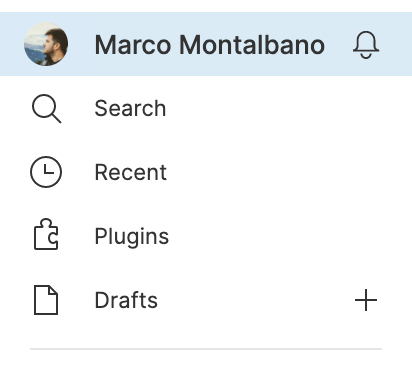

<p align="center">
    
</p>

<p align="center">
    Export tool for Figma.
</p>

<p align="center">
    You can easily and automatically export your figma components and styles and use them directly into your website.
</p>

<p align="center">
    <a href="https://github.com/marcomontalbano/figma-export"></a>
    <a href="https://coveralls.io/github/marcomontalbano/figma-export?branch=master"></a>
</p>


## :sparkles: In Short

### Components

You can export your Figma Components as SVG and use them inside your website.

> This is particularly useful when you have your own icon set and you want to keep your website icons up-to-date with your Figma file.

### Styles

You can export your Figma Styles into different output like `.sass` format, `.scss` format or you can create your own outputter.

> If you want to keep the style of your Figma file in-sync with the `.css` of your website, this is a must-have.

#### :art: Colors (paints)
- [x] Color
- [x] Linear Gradient

#### :lollipop: Effects

> Shadow and Blur effects cannot be combined together since they use two different CSS properties.

- [x] Inner Shadow
- [x] Drop Shadow
- [x] Layer Blur

#### :pencil2: Text

- [x] font-family
- [x] font-weight
- [x] font-size
- [x] line-height
- [x] letter-spacing
- [x] font-style
- [x] font-variant
- [x] text-transform
- [x] text-decoration
- [x] text-align


## :old_key: Personal Access Token

First of all you have to set the environment variable `FIGMA_TOKEN`.

To do so, you need a **Personal Access Token**. You can generate one from your *Account Settings*.



Inside the Account Settings click on *Create a new personal access token* and enter a description.

Copy the token, this is your only chance to do so!

```sh
export FIGMA_TOKEN=<personalAccessToken>
```

> You can use [dotenv](https://www.npmjs.com/package/dotenv) or `export` the variable using `.bash_profile`/`.bashrc` file.


## :test_tube: Just Try

If you wanna try it just run following command and you will be able to download all components from https://www.figma.com/file/RSzpKJcnb6uBRQ3rOfLIyUs5 as .svg :sunglasses:

```sh
# export figma token
export FIGMA_TOKEN=<personalAccessToken>

# export figma components as svg
npx -p @figma-export/cli -p @figma-export/output-components-as-svg figma-export components RSzpKJcnb6uBRQ3rOfLIyUs5 -O @figma-export/output-components-as-svg
```

or you can export all styles into `.scss`

```sh
# export figma token
export FIGMA_TOKEN=<personalAccessToken>

# export figma styles as .scss variables
npx -p @figma-export/cli -p @figma-export/output-styles-as-sass figma-export styles RSzpKJcnb6uBRQ3rOfLIyUs5 -O @figma-export/output-styles-as-sass
```


## :package: Packages

### [@figma-export/core](/packages/core)

This package contains the core functionalities for `figma-export`. You can download and use it as a dependency of your project.

### [@figma-export/cli](/packages/cli)

This package allows you to consume all core functionalities from your terminal.

## :book: Usage

Typically you'll prefer to use the `cli`. Here different ways to do the same:

### Build Process

You can use `figma-export` as part of your build process.

```sh
npm install --save-dev @figma-export/cli @figma-export/output-components-as-svg @figma-export/output-styles-as-sass

# or using `yarn`
yarn add @figma-export/cli @figma-export/output-components-as-svg @figma-export/output-styles-as-sass --dev
```

Now you can create a `script` command inside your `package.json`.

Following an example:

```diff
{
  "scripts": {
+   "figma:export-components": "figma-export components RSzpKJcnb6uBRQ3rOfLIyUs5 -O @figma-export/output-components-as-svg",
+   "figma:export-styles": "figma-export styles RSzpKJcnb6uBRQ3rOfLIyUs5 -O @figma-export/output-styles-as-sass",
  }
}
```

### Use it on the fly

Alternatively you can use `npx` to use it on the fly:

```sh
npx @figma-export/cli help
```

### Global Setup

You can also install it as a global dependency:

```sh
npm install -g @figma-export/cli

# or using `yarn`
yarn add @figma-export/cli --global
```

```sh
figma-export help
```

### Advanced

Last but not least, you can create a configuration file and use a single command *to rule them all* :ring:

Let's create the file `.figmaexportrc.js` and paste the following:

```js
module.exports = {

    commands: [

        ['styles', {
            fileId: 'RSzpKJcnb6uBRQ3rOfLIyUs5',
            outputters: [
                require('@figma-export/output-styles-as-sass')({
                    output: './output/styles'
                })
            ]
        }],

        ['components', {
            fileId: 'RSzpKJcnb6uBRQ3rOfLIyUs5',
            onlyFromPages: ['icons', 'monochrome'],
            transformers: [
                require('@figma-export/transform-svg-with-svgo')({
                    plugins: [
                        { removeViewBox: false },
                        { removeDimensions: true }
                    ]
                })
            ],
            outputters: [
                require('@figma-export/output-components-as-svg')({
                    output: './output/components'
                })
            ]
        }]

    ]

};
```

now you can install the `@figma-export` dependencies that you need

```sh
npm install --save-dev @figma-export/cli @figma-export/output-styles-as-sass @figma-export/transform-svg-with-svgo @figma-export/output-components-as-svg @figma-export/output-styles-as-sass
```

and update the `package.json`.

```diff
{
  "scripts": {
+   "figma:export": "figma-export use-config"
  }
}
```

If needed you can also provide a different configuration file.

```diff
{
  "scripts": {
+   "figma:export": "figma-export use-config .figmaexportrc.production.js"
  }
}
```

## :books: More Packages

For the list of all official packages or if you want to create your own transformer or outputter you can continue reading [CLI Documentation](/packages/cli#readme).
